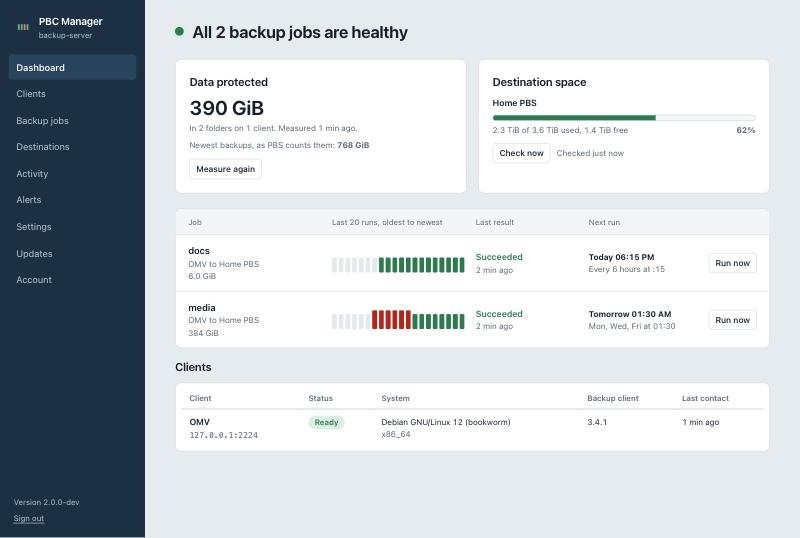
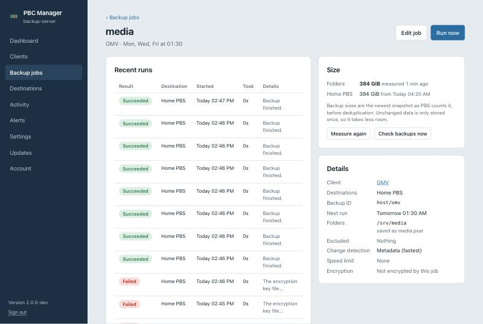

# PBC Manager

A self-hosted web UI for file-level backups with `proxmox-backup-client`. One central server manages backups on many Linux machines over SSH. Each machine sends its data straight to one or more Proxmox Backup Server datastores.



## How it works

- **Clients never depend on the server.** Each client keeps its own schedules, as systemd timers, and its own credentials, and backs up straight to PBS. If the server is down, backups still run, and the server catches up on the results when it's back.
- **Set up over SSH, no agent.** The server signs in to a client once as root, or as a sudo user. It installs `proxmox-backup-client` if it's missing and creates a limited `pbcm` account that can only run PBC Manager's helper.
- **Many clients and destinations.** A job backs up a client's folders to one or more PBS datastores, with its own schedule, exclusions, speed limit and encryption key.
- **Everything in the browser:** setup, every setting, updates, and moving over from 1.x. Only the first install, and the recovery commands for when you're locked out, need a terminal.



## Features

- **Dashboard:**
  - each client with its backup jobs, in sections you can expand or collapse
  - the health of every job, with its last 20 runs
  - how much data is protected
  - how full each datastore is
  - success rates, runs per day, and the largest and longest-running backups
- **Backup jobs:**
  - several folders per job, chosen with a folder browser on the client
  - exclusions, change detection mode, speed limit, encryption key file
  - schedules: daily on chosen days, every few hours, or only by hand
- **Run now, cancel, live logs,** run history across all clients, and snapshot lists from PBS.
- **Email alerts** when a backup fails, a scheduled backup doesn't run, a client can't be reached, or a datastore is nearly full.
- **Updates from the web UI:**
  - signed releases, checked before installing
  - automatic rollback if a new version doesn't start
  - optional automatic installs
- **Security:**
  - two-step sign-in with recovery codes
  - credentials encrypted at rest and never shown again
  - pinned SSH host keys
  - HTTPS with a self-signed certificate or your own

## Requirements

- **Server:** Debian 12 or 13 on x86-64 or ARM64. A small LXC container on Proxmox VE works well.
- **Clients:**
  - Debian 12 or 13, or a system based on them, on x86-64. That includes Proxmox VE, OpenMediaVault and Ubuntu.
  - Or ARM64 (aarch64), such as a Raspberry Pi with a 64-bit OS, based on Debian 13.
  - Reachable over SSH from the server, on your LAN or a VPN.
- **Proxmox Backup Server** with an API token for each client.

## Install

On the server, as root:

```bash
apt-get update && apt-get install -y curl
curl -fsSLO https://raw.githubusercontent.com/bradyloveland/pbcmanager/main/install.sh
bash install.sh
```

It prints the web address and a one-time **setup code**. Open the address, enter the code and create the admin account.

## Documentation

- [Installing the server](docs/guide/install.md), including an LXC recipe and the installer's options
- [Setting up Proxmox Backup Server](docs/guide/pbs.md): users, API tokens and permissions
- [Clients](docs/guide/clients.md): adding, repairing and removing them
- [Updates](docs/guide/updates.md)
- [Moving from PBS Backup Manager 1.x](docs/guide/moving-from-1x.md)
- [Troubleshooting](docs/guide/troubleshooting.md), including the recovery commands

## Version 1.x

PBS Backup Manager 1.x ran on the one machine it backed up. Its last release, [1.2.0](https://github.com/bradyloveland/pbcmanager/releases/tag/v1.2.0), stays available. Version 2 can import its settings: see [Moving from 1.x](docs/guide/moving-from-1x.md).

## Development

See [docs/development.md](docs/development.md) and the design in [docs/design-v2.md](docs/design-v2.md).

## License

MIT. See [LICENSE](LICENSE).

This project isn't affiliated with or endorsed by Proxmox Server Solutions GmbH. Proxmox is their registered trademark.
