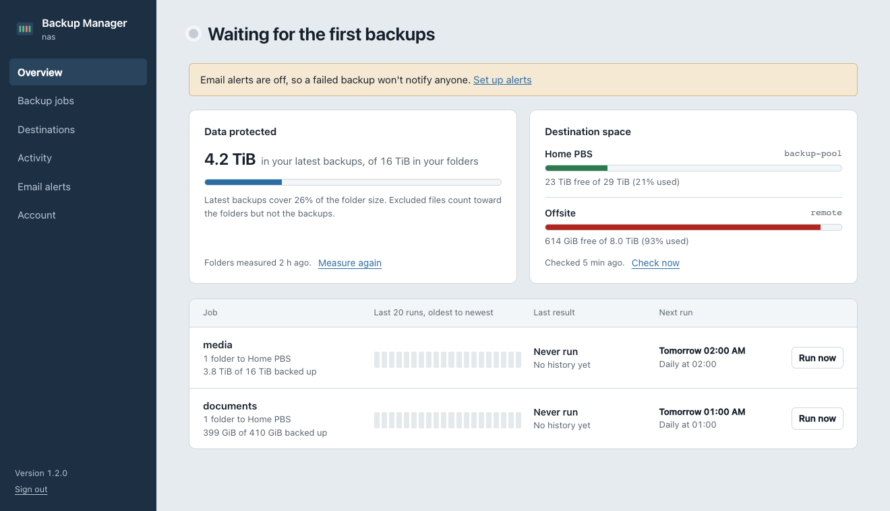

# PBS Backup Manager

A small, self-hosted web UI for file-level backups to [Proxmox Backup Server](https://www.proxmox.com/en/proxmox-backup-server) with `proxmox-backup-client`. It's built for NAS boxes like OpenMediaVault, but runs on any Linux machine with Python 3.8+ and systemd.



## Features

- **Destinations.** Store PBS servers, datastores and API tokens, with a connection test that shows datastore usage.
- **Backup jobs.** Choose folders with a built-in folder browser, set exclusions, an upload speed limit, change-detection mode and optional client-side encryption.
- **Schedules.** Run by hand, on chosen days at a set time, or every few hours. Jobs queue and run one at a time by default.
- **Dashboard.** See each job's last 20 runs at a glance, how much of your data is in a backup, and how much space each destination has left.
- **Live logs and alerts.** Watch a backup as it runs, cancel it, and get an email when one fails, with the reason and the end of the log.
- **Secure sign-in.** Username and password, optional two-step verification with any authenticator app, recovery codes and brute-force protection.
- **Reverse-proxy ready.** Trusted `X-Forwarded-*` handling, sub-path hosting and a health endpoint.
- **Export and import.** Move your settings to another machine or keep a copy; credentials are never included.
- **No dependencies.** Python standard library only. Nothing to `pip install`.

## Quick start

Download the latest package from [Releases](https://github.com/bradyloveland/pbswebclient/releases), or clone the repository:

```bash
git clone https://github.com/bradyloveland/pbswebclient.git
cd pbswebclient
sudo ./install.sh
```

Open `https://<machine-ip>:8099`, sign in as `admin` with the password you chose, then:

1. **Destinations → Add a destination.** Enter your PBS host, datastore, user, API token and fingerprint. See [Preparing Proxmox Backup Server](docs/pbs-setup.md) for creating the token and its permissions.
2. **Backup jobs → Create a backup job.** Pick folders and a schedule.
3. **Email alerts.** Add your SMTP details and send a test email.
4. **Account.** Turn on two-step verification.

To run it behind Nginx, Caddy, Nginx Proxy Manager or Traefik, install with `--behind-proxy` or `--proxy-ip`. See [Reverse proxy](docs/reverse-proxy.md).

## Documentation

| Guide | What's in it |
| --- | --- |
| [Installation](docs/installation.md) | Requirements, installer options, upgrading, uninstalling, file locations |
| [Preparing Proxmox Backup Server](docs/pbs-setup.md) | Creating the user, API token and permissions |
| [Using the app](docs/usage.md) | Destinations, jobs, schedules, exclusions, seeding large folders, the dashboard, export and import |
| [Reverse proxy](docs/reverse-proxy.md) | Example configurations and how forwarded headers are trusted |
| [Security](docs/security.md) | How credentials, sessions and two-step verification work |
| [Troubleshooting](docs/troubleshooting.md) | Common errors and how to fix them |
| [HTTP API](docs/api.md) | Endpoint reference |
| [Development](docs/development.md) | Architecture, running the tests, contributing |

## Command line

```bash
sudo pbs-manager passwd            # reset the admin password
sudo pbs-manager totp-reset        # turn off two-step verification
sudo pbs-manager configure --help  # port, bind address, TLS, proxies, base path, concurrency
sudo pbs-manager export -o settings.json
sudo pbs-manager import settings.json   # with the service stopped
journalctl -u pbs-manager -f       # service log
```

## License

[MIT](LICENSE)
